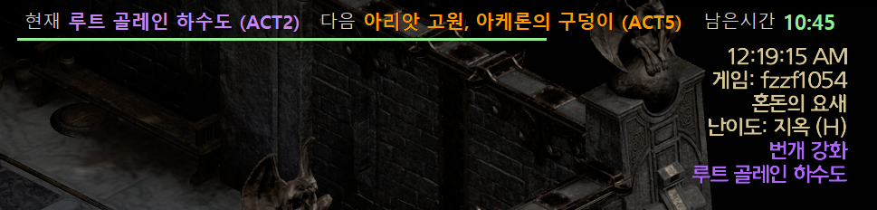
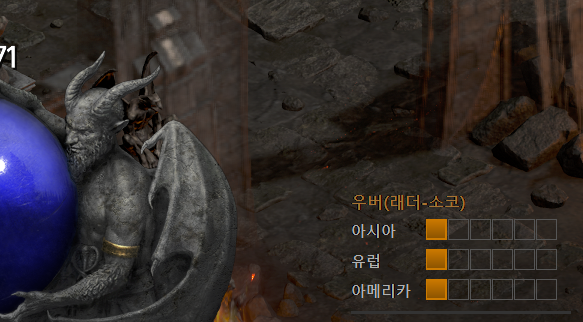
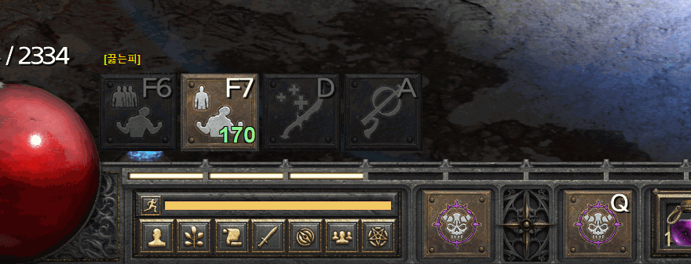
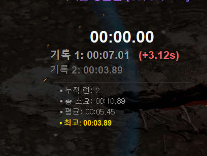
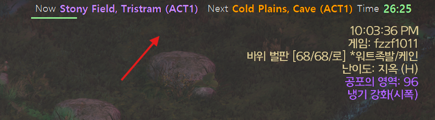
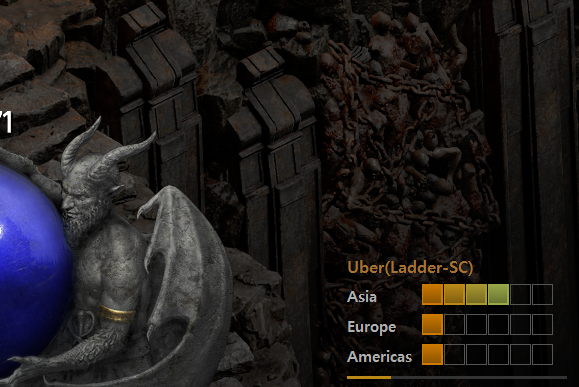
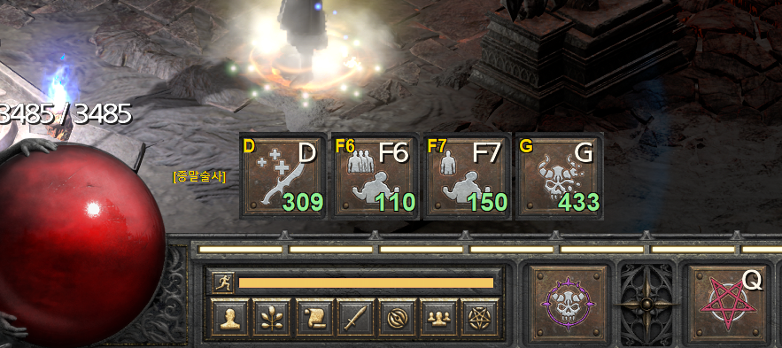
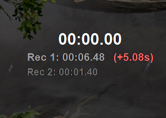

[🇰🇷 한국어 (Korean)](#korean) | [🇺🇸 English](#english)

# 🛡️ 디아블로 2: 레저렉션 다기능 유틸리티 오버레이 (D2R Utility Overlay - DUO)

디아블로 2: 레저렉션 플레이를 더욱 쾌적하게 만들어주는 **다기능 유틸리티 오버레이(DUO)** 프로그램입니다. 기존의 **다음 공역(Terror Zone)** 및 **우버디아(Diablo Clone)** 실시간 추적 기능은 물론, 사용자 맞춤형 **버프 스킬 타이머** 및 **스피드런 타이머** 등 게임에 유용한 다양한 편의 기능들을 화면 위에 실시간으로 제공합니다.

> **📢 알림:** 기능이 많아지면서 하나하나 테스트하는 데 시간이 많이 소요되고 있습니다. (예: 테러존 API 갱신 테스트 시 최소 30분 대기 등) 따라서 일부 버그나 미흡한 점이 있더라도 너그럽게 양해 부탁드립니다. 저 또한 게임 플레이 시 이 프로그램을 항상 사용하고 있으므로, 오류를 발견하는 대로 최대한 빠르게 수정하여 업데이트하겠습니다!

---

## 📑 목차 (Table of Contents)
* [📸 스크린샷 (Screenshots)](#screenshots-kr)
* [🚀 시작하기 (Quick Start)](#getting-started-kr)
* [⌨️ 단축키 안내 (Hotkeys)](#hotkeys-kr)
* [✨ 주요 기능 (Key Features)](#features-kr)
* [📂 파일 및 폴더 설명](#files-kr)
* [💻 테스트 환경 및 주의사항 (Troubleshooting)](#environment-kr)
* [🔧 최근 업데이트 내역 (Recent Updates)](#updates-kr)
* [☕ 피드백 & 후원하기 (Contact & Support)](#support-kr)

---

## 📸 스크린샷 (Screenshots)

### 1. 테러존 & 우버디아 오버레이

> 화면 상단에 다음 공역 정보 및 남은 시간을, 우측 하단에 대륙별 우버디아 진행도를 직관적인 블록(`■■■□□□`)으로 표시합니다.

### 2. 사용자 맞춤형 버프 오버레이 & 스피드런 타이머

> 내가 원하는 스킬 아이콘을 캡처하여 버프 지속 시간을 확인하고, 보스 파밍이나 런 반복 시 소요 시간을 측정해 이전 기록과 비교할 수 있습니다.

---

## 🚀 시작하기 (Quick Start)

### 1. 다운로드 및 준비
1. 우측 **Releases** 메뉴에서 최신 버전의 **`.zip` 파일**을 다운로드 후 압축을 풉니다.
2. 원활한 데이터 수신을 위해 [d2tz.info 회원가입/로그인](https://www.d2tz.info/login) 후 **User Profile**에서 개인 **API Key(Token)** 를 복사합니다.

> **💡 버전 업데이트 시 기존 설정 유지 방법**
> * **자동 업데이트 (권장):** 프로그램 실행 시 최신 버전 알림이 뜨면 하단의 **`⚡ 자동 업데이트`** 버튼을 클릭하세요. 기존 설정(UI 위치, 폰트, 즐겨찾기, 프로필 등)이 모두 유지된 채 안전하게 자동 설치 및 재실행됩니다.
> * **수동 업데이트:** 깃허브에서 새 버전을 직접 다운로드할 경우, 기존에 쓰던 폴더에서 `d2_overlay_config.json`, `favorite_tz.json`, `profiles` 폴더를 복사하여 새 버전 폴더에 덮어쓰기 하시면 됩니다.

> 💡 새 버전이 감지되면 테러존 패널 하단에 **`⚡ 자동 업데이트`** 버튼이 나타납니다.

### 2. 실행 및 설정
1. **디아블로 2: 레저렉션**을 먼저 실행합니다. (전체화면 모드 권장)
2. `d2_tz.exe` 파일을 실행합니다. *(게임 클라이언트를 관리자 권한으로 실행했다면 이 프로그램도 관리자 권한으로 실행해야 합니다.)*
3. 시스템 트레이(우측 하단 시계 옆)에 나타난 빨간색 아이콘을 **우클릭** ➔ **`🔑 API 토큰 설정`** 에 복사한 키를 붙여넣습니다.
4. 트레이 아이콘 우클릭 ➔ **`⚙️ 환경설정`** 에서 언어, 폰트, 오버레이 위치, 타이머 등 입맛에 맞게 세팅합니다.

---

## ⌨️ 단축키 안내 (Hotkeys)

오버레이를 더욱 빠르고 편리하게 제어하기 위한 단축키입니다. (단축키는 환경설정에서 변경 가능)

| 구분 | 단축키 | 기능 설명 |
| :--- | :---: | :--- |
| **공통 설정** | `Ctrl` + `Shift` + `S` | 환경설정 창 즉시 열기 (게임 중) |
| | `Ctrl` + `Shift` + `Q` | 프로그램 완전 종료 |
| **버프 타이머** | `PageUp` / `PageDown` | 버프 스킬 프로필 전환 |
| | `Ctrl` + `Shift` + `A` | 버프 스킬 화면 캡처 및 즉시 등록 |
| | 사용자가 설정한 키 | 지정한 버프 타이머 실행 |
| **스피드런** | `Home` | 타이머 시작 / 일시정지 |
| | `End` | 런 기록 완료 및 통계 저장 |
| | `Shift` + `Delete` | 스피드런 타이머 및 누적 통계 초기화 |

---

## ✨ 주요 기능 (Key Features)

**1. 테러존 & 우버디아 트래킹**
* **스마트 즐겨찾기 알림:** 원하는 공역 지정 시 발견 즉시, 그리고 시작 5분 전에 텍스트 깜빡임 및 소리로 알려줍니다.
* **우버디아 맞춤 알림:** 확장팩(LoD/RotW) 선택이 가능하며 단계 상승 시 소리 알림을 제공합니다.
* **초절전 스마트 폴링:** 트래픽 낭비 방지를 위해 갱신이 필요한 시점에만 API를 정교하게 호출합니다.

**2. 스피드런 타이머 & 통계**
* 보스 파밍 시 클리어 타임을 측정하며, 최근 두 번의 기록과 직관적인 시간 차이(단축 시 녹색, 지연 시 붉은색)를 제공합니다.

**3. 강력한 버프 오버레이**
* 스킬 아이콘 캡처 기능으로 나만의 버프 트래커를 구축할 수 있습니다. 
* 기본 음원 외에 `sounds` 폴더에 원하는 파일(`.wav`, `.mp3`)을 넣어 스킬별로 개별 알림음을 지정할 수 있습니다.

**4. 완벽한 게임 통합 & UI 편의성**
* **클릭 관통 (Click-through):** 오버레이가 마우스 클릭을 방해하지 않습니다.
* **자동 숨김 & 창 모드 지원:** 게임 창이 활성화되었을 때만 표출되며, 멀티 로더 환경도 완벽하게 지원합니다.
* **자유로운 레이아웃:** 드래그 앤 드롭으로 패널 위치를 조정할 수 있고 세로 배치 모드도 지원합니다.
* **자동 업데이트:** 최신 버전 감지 시 UI 하단에 릴리즈 노트 확인 및 자동 업데이트 버튼이 나타납니다.

---

## 📂 파일 및 폴더 설명

| 파일/폴더명 | 설명 |
| :--- | :--- |
| `d2_tz.exe` | 프로그램 메인 실행 파일 |
| `area.json` | ⚠️ 테러존 다국어 번역 필수 데이터 (삭제 금지) |
| `d2_overlay_config.json` | 사용자 환경설정 저장 파일 (자동 생성) |
| `favorite_tz.json` | 즐겨찾기 알림 공역 목록 저장 파일 (자동 생성) |
| `profiles/` | 캡처한 버프 스킬 아이콘 및 설정(`config.json`)이 저장되는 폴더 |
| `sounds/` | 버프 종료 임박 시 사용할 사용자 지정 알림음 보관 폴더 |

---

## 💻 테스트 환경 및 주의사항 (Troubleshooting)

이 프로그램은 아래의 환경에서 개발 및 테스트되었습니다. 사용자 환경에 따라 약간의 차이가 있을 수 있습니다.
* **OS:** Windows 11 Pro 25H2 (64-bit)
* **Display:** 2560x1440 (QHD)
* **Game:** 디아블로 2: 레저렉션 (주로 전체화면 모드에서 테스트하며 창모드도 병행. 권장: 전체화면 모드)
* **Build:** Python 3.14

**🛡️ 백신 오탐지 안내**
키보드 단축키 감지(`keyboard`) 기능을 사용하여 일부 백신(Windows Defender 등)에서 **오탐지(False Positive)** 할 수 있습니다. 
* 실행이 차단되거나 파일이 삭제되면, 폴더를 **백신 검사 제외 대상**으로 등록해 주세요.
* 윈도우 **스마트 앱 컨트롤(Smart App Control)** 이 켜져 있다면 해제해야 실행 가능합니다.

---

## 🔧 최근 업데이트 내역
* **[추가]** 스피드런 타이머(스톱워치) 및 이전 런(기록 1, 2) 비교 패널 기능 추가
* **[제거]** 하드코딩된 테러존 번역을 `area.json` 의존성으로 일원화하여 경량화
* **[수정]** 숫자 폰트 크기 차이로 인한 테러존 패널 흔들림 현상 개선
* **[수정]** 스킬 추가 모드 단축키 변경 (`Ctrl+A` ➔ `Ctrl+Shift+A`)
* **[추가]** 버프 스킬별 사운드 개별 지정 기능 및 전용 볼륨 슬라이더 추가
* **[대응]** 멀티로더 환경 대응 (실행 파일명 인식)

---

## ☕ 피드백 & 후원하기 (Contact & Support)

### 💡 버그 신고 및 기능 제안 (Feedback)
프로그램 사용 중 발생하는 **버그(문제)** 나 **새로운 기능 제안**은 언제든지 환영합니다! 아래의 편한 방법으로 알려주세요.
* **GitHub Issues (권장):** [이슈 페이지(클릭)](https://github.com/ggeonu-abi/d2_tz_tracker/issues)에 글을 남겨주시면 개발자가 가장 빠르고 체계적으로 확인하고 처리 상태를 추적할 수 있습니다.
* **이메일 문의:** GitHub 사용이 익숙하지 않으시다면 `mdloopy02@gmail.com` 으로 편하게 메일 보내주셔도 좋습니다.

### ☕ 후원하기 (Donation)
**본 프로그램은 누구나 무료로 자유롭게 사용할 수 있습니다!** 만약 이 프로그램이 게임 플레이에 큰 도움이 되셨다면, 향후 지속적인 업데이트와 더 좋은 기능 개발을 위해 커피 한 잔의 여유를 선물해 주시면 큰 힘이 됩니다!

* [👉 카카오페이로 커피 한 잔 후원하기 (모바일 환경에서 링크 클릭)](https://qr.kakaopay.com/FTeinPf5n9c405794)

> PC 환경이신 경우, 아래의 QR 코드를 스마트폰 기본 카메라나 카카오톡 스캔 기능으로 찍어주세요!

---

   

---

# 🛡️ Diablo 2: Resurrected Utility Overlay (DUO)

[⬆️ Back to Top / 한국어](#korean)

A **multi-purpose utility overlay (DUO)** designed to comprehensively enhance your Diablo 2: Resurrected gameplay. In addition to real-time tracking for the upcoming **Terror Zone** and **Diablo Clone** progression across servers, it provides various quality-of-life utilities, such as a highly customizable **Buff Skill Timer** and a new **Speedrun Timer**, directly on your game screen.

> **📢 Notice:** As the number of features continues to grow, testing each one takes a considerable amount of time. Therefore, please be understanding if you encounter any minor bugs. Since I also actively use this program for my own gameplay, I will make sure to fix any discovered errors as quickly as possible!

---

## 📑 Table of Contents
* [📸 Screenshots](#screenshots-en)
* [🚀 Getting Started](#getting-started-en)
* [⌨️ Hotkeys](#hotkeys-en)
* [✨ Key Features](#features-en)
* [📂 File & Folder Descriptions](#files-en)
* [💻 Tested Environment & Troubleshooting](#environment-en)
* [🔧 Recent Updates](#updates-en)
* [☕ Contact & Support](#support-en)

---

## 📸 Screenshots

### 1. Next Terror Zone & DClone Progress

### 2. Buff Overlay & Speedrun Timer

---

## 🚀 Getting Started

### 1. Download & Preparation
1. Click the latest version in the **Releases** section on the right and download the **`.zip` file**.
2. Sign up/Login to [d2tz.info](https://www.d2tz.info/login) and copy your **API Key (Token)** from the User Profile page.

> **💡 How to keep your settings when updating:**
> * **Auto-Update (Recommended):** Simply click the **`⚡ Auto-Update`** button on the overlay when a new version is detected. It will safely download and install the update while preserving all your custom settings, profiles, and favorites.
> * **Manual Update:** If you download the `.zip` file manually, copy and paste your old `d2_overlay_config.json`, `favorite_tz.json`, and `profiles` folder into the new version's folder.

> 💡 When a new version is detected, the **`⚡ Auto-Update`** button appears at the bottom of the Terror Zone panel.

### 2. Run & Configure
1. Run **Diablo 2: Resurrected**. (Fullscreen Mode recommended).
2. Run `d2_tz.exe`. *(Run as administrator if your D2R client is also running as admin).*
3. **Right-click** the red icon in your Windows system tray ➔ **`🔑 Set API Token`** and paste your key.
4. Right-click the icon again ➔ **`⚙️ Settings`** to customize layouts, hotkeys, and features.

---

## ⌨️ Hotkeys

| Category | Hotkey | Function |
| :--- | :---: | :--- |
| **Global** | `Ctrl` + `Shift` + `S` | Open Settings Instantly |
| | `Ctrl` + `Shift` + `Q` | Exit Program Completely |
| **Buff Overlay** | `PageUp` / `PageDown` | Switch Buff Profiles |
| | `Ctrl` + `Shift` + `A` | Capture & Add Skill Instantly |
| | User Defined Keys | Trigger Specific Buff Timer |
| **Speedrun** | `Home` | Timer Start / Pause |
| | `End` | Record Run Time & Save Stats |
| | `Shift` + `Delete` | Reset speedrun timer and all session stats |

---

## ✨ Key Features

**1. Real-time TZ & DClone Tracker**
* **Custom Favorite Alerts:** Get text blinks and sound notifications when your favorite zones are discovered and 5 mins before they start.
* **Uber Alerts:** Choose your expansion (LoD/RotW) and get notified when DClone stages increase.
* **Smart Polling:** Highly optimized API calls to prevent traffic waste.

**2. Speedrun Timer & Stats**
* Stopwatch panel to track run times with direct comparison to your last two records (green for faster, red for slower).

**3. Powerful Buff Overlay**
* Build your own buff tracker using the built-in screen capture tool.
* Assign custom audio files (`.wav`, `.mp3`) placed in the `sounds` folder to individual skills.

**4. UI & Convenience**
* **Click-through:** Mouse clicks pass right through the overlay.
* **Auto-Hide:** Automatically hides when switching to a browser or another app. Fully supports multi-client setups.
* **Free Layout:** Drag and drop panels anywhere. Vertical modes are also supported.
* **Auto-Update:** Notifies you of new versions with quick links to Release Notes and a 1-click update button.

---

## 📂 File & Folder Descriptions

| File / Folder | Description |
| :--- | :--- |
| `d2_tz.exe` | Main executable file. |
| `area.json` | ⚠️ Essential TZ translation data (Do not delete). |
| `d2_overlay_config.json` | Auto-saved user preferences (UI, fonts, volume). |
| `favorite_tz.json` | Auto-saved list of your favorite TZ alerts. |
| `profiles/` | Folder containing your captured buff icons and `config.json`. |
| `sounds/` | Place your custom `.mp3` or `.wav` files here for buff alerts. |

---

## 💻 Tested Environment & Troubleshooting

* **OS:** Windows 11 Pro 25H2 (64-bit)
* **Display:** 2560x1440 (QHD)
* **Game:** Diablo 2: Resurrected (Recommended: Fullscreen Mode)
* **Build:** Python 3.14

**🛡️ Security & False Positives**
This program uses the `keyboard` module to detect hotkeys. Some antivirus software (e.g., Windows Defender) may flag it as a **False Positive**.
* **Fix:** Add the program folder to your antivirus **exclusion list**.
* Turn off **Smart App Control** in Windows 11 if it blocks execution.

---

## 🔧 Recent Updates
* **[Added]** Speedrun Timer (Stopwatch) panel with previous record tracking.
* **[Removed]** Hardcoded TZ translations; now reliant purely on `area.json` for a lighter build.
* **[Fixed]** Addressed an issue where the Terror Zone panel would constantly move when number font sizes were different.
* **[Modified]** Changed the skill capture hotkey to `Ctrl+Shift+A`.
* **[Added]** Custom sound assignment per buff skill with a dedicated volume slider.
* **[Supported]** Added support for multi-loader environments (recognizes executable names).

---

## ☕ Contact & Support

### 💡 Bug Reports & Feature Requests (Feedback)
If you encounter any **bugs** or have ideas for **new features**, please feel free to let me know using the methods below!
* **GitHub Issues (Recommended):** Please leave a post on the [GitHub Issues page (Click)](https://github.com/ggeonu-abi/d2_tz_tracker/issues) for the fastest response and organized tracking.
* **Email:** If you are not familiar with GitHub, you can always send an email to `mdloopy02@gmail.com`.

### ☕ Support (Donation)
**This program is 100% free to use for everyone!**
However, if you found this tool helpful for your gameplay and wish to support its ongoing development, you can optionally buy the developer a coffee. Your support is always greatly appreciated!

* [👉 Buy me a coffee via PayPal (For non-Korean users)](https://paypal.me/haruyozzang/4)
* [👉 Buy me a coffee via KakaoPay (Click link on mobile)](https://qr.kakaopay.com/FTeinPf5n9c405794)

> If you are on a PC, please scan the QR code below using your smartphone's camera!

---

<a href="https://lifemoneyhub.com">d2_tz_tracker</a> © 2026 by <a href="https://lifemoneyhub.com">Vellen</a> is licensed under <a href="https://creativecommons.org/licenses/by-nc-nd/4.0/">CC BY-NC-ND 4.0</a>

**Credits:** Data provided by [D2TZ.info](https://www.d2tz.info/)