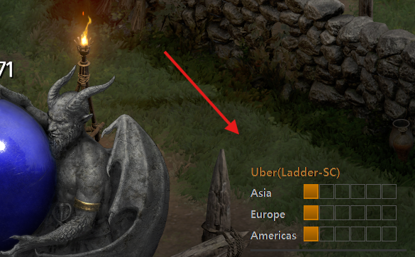

# 🛡️ 디아블로 2: 레저렉션 공역 & 우버디아 트래커 (D2R Tracker)

디아블로 2: 레저렉션 플레이 중 **다음 공역(Terror Zone)** 정보와 **우버디아(Diablo Clone)** 의 각 서버별 진행 상황을 게임 화면 위에 실시간으로 표시해 주는 투명 오버레이 프로그램입니다.

---

## ☕ 후원하기 (Support)
이 프로그램이 마음에 드셨다면, 개발자가 더 좋은 기능을 만들 수 있도록 커피 한 잔의 여유를 선물해 주세요! 

* [👉 카카오페이로 커피 한 잔 후원하기 (모바일 환경에서 링크 클릭)](https://qr.kakaopay.com/FEnWDeSNr9c407373)
> PC 환경이신 경우, 아래의 QR 코드를 스마트폰 기본 카메라나 카카오톡 스캔 기능으로 찍어주세요!

---

## 📸 스크린샷 (Screenshots)

### 1. 다음 공역 및 진행률 표시

> 화면 우측 상단에 다음 시간대의 공역 정보와 다음 갱신까지 남은 시간을 퍼센트(%) 바 형태로 제공합니다.

### 2. 우버디아(Diablo Clone) 진행도 표시

> 화면 우측 하단에 아시아, 유럽, 아메리카 서버의 현재 우버디아 진행도를 6단계 블록(`■■■□□□`)으로 직관적으로 표시합니다.

---

## ✨ 주요 기능

* **실시간 공역 알림:** 매시 정각 및 30분마다 업데이트되는 다음 공역 정보를 한글로 표시합니다. (ACT 정보 포함)
* **우버디아 프로그레스 바:** 아시아, 유럽, 아메리카 서버의 진행도를 6단계(`■■■□□□`) 바 형태로 우측 하단에 표시합니다.
* **스마트 타이머:** 정확하고 빠른 정보 갱신을 위해 1분(60초)마다 한 번씩 백그라운드에서 데이터를 안전하게 동기화합니다.
* **완벽한 게임 통합:** 투명 창 모드로 작동하며, 마우스 클릭이 오버레이를 통과하므로 게임 플레이에 전혀 지장을 주지 않습니다.
* **개인 설정 저장:** 래더/스탠, 하드코어/소프트코어 설정 및 개인 API 토큰 등 설정값이 `d2_overlay_config.json`에 자동 저장됩니다.

---

## 🚀 시작하기

### 1. 개인 API Key(Token) 발급받기
본 프로그램은 빠르고 안정적인 실시간 정보 제공을 위해 개인 API Key가 필요합니다.
1. [d2tz.info 회원가입/로그인](https://www.d2tz.info/user-profile) 페이지로 접속합니다.
2. 가입 및 로그인 후, **User Profile** 페이지에서 본인의 **API Key(Token)** 문자를 복사합니다.

### 2. 실행 및 설정 방법
1.  다운로드한 `d2_tz.exe` 파일과 **`area.json` 파일을 반드시 같은 폴더에** 위치시킵니다. (`area.json` 파일은 공역 이름의 한글 번역 데이터를 불러오는 데 꼭 필요합니다.)
2.  **디아블로 2: 레저렉션**을 실행합니다. (창 모드 또는 전체 화면 창 모드 권장)
3.  `d2_tz.exe` 파일을 실행합니다.
4.  화면에 "토큰 설정 필요"라는 문구가 뜨면, 윈도우 우측 하단 작업 표시줄(시스템 트레이)에 있는 빨간색 아이콘을 **우클릭**합니다.
5.  메뉴 최상단의 **`🔑 API 토큰 설정 (d2tz.info)`** 를 클릭하고, 아까 복사해둔 API Key를 붙여넣기 한 뒤 확인을 누릅니다.
6.  화면 우측 상단에 **다음 공역** 정보가, 우측 하단에는 **우버디아 진행도**가 정상적으로 나타납니다.

### 3. 단축키 및 메뉴 설정
* **프로그램 완전 종료:** `Ctrl` + `Shift` + `Q`
* **환경설정:** 작업 표시줄(시스템 트레이)의 빨간 아이콘을 **마우스 우클릭**하여 모드 변경(래더/스탠, 하코/소코) 및 우버 표시 ON/OFF를 설정할 수 있습니다.

---

## 🛡️ 보안 및 백신 오탐지 안내 (Security)

본 프로그램은 파이썬(Python) 기반으로 제작되었으며, 키보드 단축키 감지를 위해 `keyboard` 라이브러리를 사용합니다. 이 과정에서 일부 백신 프로그램(Windows Defender 등)이 **오탐지**(False Positive)하여 실행을 차단하거나 파일을 삭제할 수 있습니다.

* **해결 방법:** 실행이 되지 않을 경우, 프로그램이 위치한 폴더를 **백신 검사 제외 대상**으로 등록한 후 다시 실행해 주시기 바랍니다.
* 본 프로그램은 오픈 소스 기반의 안전한 도구이며, 어떠한 개인 정보도 수집하지 않습니다.

---

## ⚠️ 면책 조항 (Disclaimer)

* 본 프로그램은 Blizzard Entertainment와 무관하며, 게임 데이터를 직접 수정하거나 조작하지 않는 **순수 오버레이 정보 표시 도구**입니다.
* 프로그램 사용으로 인해 발생하는 모든 책임은 사용자 본인에게 있으며, 제작자는 어떠한 결과에 대해서도 책임을 지지 않습니다.
* 데이터 제공처(d2tz.info)의 서버 상황이나 이벤트 변경에 따라 정보 표시가 일시적으로 지연되거나 부정확할 수 있습니다.

---

## 📢 채널 및 문의

* **이메일:** mdloopy02@gmail.com

---

<a href="https://lifemoneyhub.com">d2_tz_tracker</a> © 2026 by <a href="https://lifemoneyhub.com">ggeonu-abi</a> is licensed under <a href="https://creativecommons.org/licenses/by-nc-nd/4.0/">CC BY-NC-ND 4.0</a>

**Credits:** Data provided by [D2TZ.info](https://www.d2tz.info/)