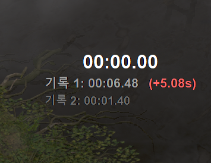

[🇰🇷 한국어 (Korean)](#korean) | [🇺🇸 English](#english)

# 🛡️ 디아블로 2: 레저렉션 다기능 스마트 오버레이 (D2R Smart Overlay)

디아블로 2: 레저렉션 플레이를 더욱 쾌적하게 만들어주는 **다기능 투명 오버레이 프로그램**입니다. 기존의 **다음 공역(Terror Zone)** 및 **우버디아(Diablo Clone)** 실시간 추적 기능은 물론, 사용자 맞춤형 **버프 스킬 타이머** 및 **스피드런 타이머** 등 게임에 유용한 다양한 편의 기능들을 화면 위에 실시간으로 제공합니다. 앞으로도 지속적인 업데이트를 통해 더욱 다채로운 오버레이 기능들이 추가될 예정입니다!

> **📢 알림:** 기능이 많아지면서 하나하나 테스트하는 데 시간이 많이 소요되고 있습니다. 예를 들어 실제 테러존 API 갱신을 테스트하려면 기본 30분 이상 대기해야 하는 등 여러 제약이 있습니다. 따라서 일부 버그나 미흡한 점이 있더라도 너그럽게 양해 부탁드립니다. 저 또한 게임 플레이 시 이 프로그램을 항상 사용하고 있으므로, 오류를 발견하는 대로 최대한 빠르게 수정하여 업데이트하겠습니다!

---

## ☕ 후원하기 (Support)
**본 프로그램은 누구나 무료로 자유롭게 사용할 수 있습니다!** 만약 이 프로그램이 게임 플레이에 큰 도움이 되셨다면, 개발자가 더 좋은 기능과 업데이트를 지속할 수 있도록 원하시는 경우에 한하여 커피 한 잔의 여유를 선물해 주세요. 응원은 언제나 큰 힘이 됩니다!

* [👉 카카오페이로 커피 한 잔 후원하기 (모바일 환경에서 링크 클릭)](https://qr.kakaopay.com/FTeinPf5n9c405794)
> PC 환경이신 경우, 아래의 QR 코드를 스마트폰 기본 카메라나 카카오톡 스캔 기능으로 찍어주세요!

---

## 📸 스크린샷 (Screenshots)

### 1. 다음 공역 및 진행률 표시

> 화면 상단에 다음 시간대의 공역 정보와 갱신까지 남은 시간을 표시합니다. (설정에 따라 남은 시간 위치 변경, 현재 공역, 진행률 바, 반투명 배경 패널 등을 자유롭게 설정할 수 있습니다.)

### 2. 우버디아(Diablo Clone) 진행도 표시

> 화면 우측 하단에 아시아, 유럽, 아메리카 서버의 현재 우버디아 진행도를 6단계 블록(`■■■□□□`)으로 직관적으로 표시합니다.

### 3. 버프 오버레이 (Buff Overlay)

> 사용자가 지정한 스킬 아이콘과 지속 시간을 오버레이로 띄워, 버프 유지 상태를 직관적으로 확인할 수 있습니다.

### 4. 스피드런 타이머 (Speedrun Timer)

> 런 반복이나 보스 파밍 시 소요 시간을 측정하고, 최근 2개의 기록(기록 1, 기록 2)과 비교하여 시간 단축/지연 여부를 직관적인 색상으로 표시해 줍니다.

---

## ✨ 주요 기능 (Key Features)

* **실시간 공역 알림:** 매시 정각 및 30분마다 업데이트되는 공역 정보를 표시합니다. (ACT 정보 포함)
* **자유로운 패널 이동 및 레이아웃 설정:** 화면 밖 이탈 방지 기능이 적용된 드래그 이동 및 '위치 초기화' 기능을 지원합니다. 가로 모드뿐만 아니라 **세로 배치 모드**를 지원하며, 테러존 정보 표시 순서(예: 다음 ➔ 현재 ➔ 시간 등)를 자유롭게 조정할 수 있습니다.
* **스마트한 UI 자동 숨김:** 디아블로 2 게임 화면이 활성화(포커스)된 상태에서만 오버레이가 표시되며, 웹 브라우저 등 다른 창을 볼 때는 화면을 가리지 않도록 자동으로 숨겨집니다. 다중 클라이언트(멀티 로더) 사용 시에도 현재 활성화된 클라이언트 위에 정상적으로 표시됩니다.
* **창 모드 완벽 지원:** 게임을 창 모드로 실행할 경우에도 타이틀바를 침범하지 않고 게임 화면 내부에 정확히 위치하도록 자동 조정됩니다.
* **사용자 맞춤형 폰트 적용 (.ttf):** 디아블로 스타일 폰트 등 원하는 `.ttf` 폰트 파일을 프로그램과 같은 폴더에 넣기만 하면, 환경설정 목록에 자동으로 나타나 오버레이 전체에 즉시 적용할 수 있습니다.
* **🔔 스마트 즐겨찾기 알림:** 원하는 공역을 즐겨찾기로 등록해 두면, 해당 공역 발견 시 및 시작 5분 전에 **부드러운 텍스트 깜빡임**과 **소리(띵동)** 로 알려줍니다. ('1층', 'Level 1' 등의 층수 명칭은 자동으로 생략되어 목록이 깔끔하게 통합 관리됩니다.)
* **우버디아 진행도 및 맞춤 알림:** 아시아, 유럽, 아메리카 서버의 진행도를 실시간으로 표시합니다. 우버디아 대상 확장팩(LoD 또는 RotW)을 직접 선택할 수 있으며, 서버 단계가 상승할 때마다 **소리로 알림**을 제공합니다.
* **스피드런 타이머 및 기록 비교:** 보스 파밍이나 특정 구간의 클리어 타임을 측정하는 스톱워치 패널을 제공합니다. 최근 두 번의 런 기록을 저장하여 이전 런 대비 직관적인 시간 차이(단축 시 녹색, 지연 시 붉은색)를 확인할 수 있습니다.
* **다국어 및 중국 서버 지원:** 한국어, 영어 외에 **중국어(간체/번체)** 인터페이스를 지원하며, 글로벌 서버와 별도로 운영되는 중국 서버 전용 테러존 데이터를 불러오는 옵션을 제공합니다. *(참고: 한국어 외에는 직접적인 테스트가 어려워 번역이 다소 어색할 수 있습니다. 양해 부탁드립니다.)*
* **⚡ 초절전 스마트 폴링:** 트래픽과 리소스 낭비를 막기 위해 정교하게 설계되었습니다. 공역 정보는 시작 시간에만 호출하며, 우버디아 현황은 이벤트가 잦은 정각 및 30분 근처(±5분)에는 30초마다, 그 외의 조용한 시간대에는 2분마다 동기화합니다.
* **완벽한 게임 통합:** 클릭 관통(Click-through) 투명 창 모드로 작동하여 게임 플레이(클릭, 이동)에 전혀 지장을 주지 않습니다.
* **버프 오버레이 기능**: 프로필별로 설정 가능한 버프 오버레이 기능을 제공합니다.
  * 단축키(`PageUp`, `PageDown`)를 사용하여 버프 오버레이 프로필을 손쉽게 전환할 수 있습니다.
  * 캡처 단축키(`Ctrl+Shift+A`)를 사용하여 현재 프로필에 스킬을 바로 캡처하고 등록할 수 있습니다.
  * 함께 배포되는 `sounds` 폴더 내의 기본 샘플 음원 외에도, 원하는 음원(.mp3, .wav)을 추가하여 **스킬별 개별 사운드**로 지정할 수 있습니다. 지정된 사운드는 타이머 깜빡임 시 재생됩니다. (드롭다운 선택 및 볼륨 0~100% 조절 지원)
  * 프로필 관리 기능을 통해 스킬 순서 변경, 삭제 및 단축키/시간 변경이 가능합니다.

---

## 🚀 시작하기

### 1. 프로그램 다운로드 (초보자 가이드)
GitHub 사용이 익숙하지 않으신 분들은 아래의 순서대로 진행해 주세요.
1. 화면 우측의 **Releases** 섹션에서 최신 버전을 클릭합니다.
2. **Assets** 항목 아래에 있는 **`.zip` 압축 파일**을 클릭하여 다운로드합니다.
3. 로컬 환경(내 PC)에서 다운로드한 파일의 압축을 해제합니다.
> **💡 팁:** 버전 업데이트 시 기존 설정과 프로필을 그대로 유지하려면 아래의 파일 및 폴더를 새 버전 폴더에 덮어쓰기 하시면 됩니다.
> * `d2_overlay_config.json` (기본 환경설정)
> * `favorite_tz.json` (즐겨찾기 목록)
> * `profiles` 폴더 (스킬 및 사운드 설정 등)

### 2. 개인 API Key(Token) 발급받기
본 프로그램은 빠르고 안정적인 실시간 정보 제공을 위해 개인용 API Key가 필요합니다.
1. [d2tz.info 회원가입/로그인](https://www.d2tz.info/login) 페이지로 접속합니다.
2. 가입 및 로그인 후, **User Profile** 페이지에서 본인의 **API Key(Token)** 문자를 복사합니다.
> **⚠️ 주의사항:** d2tz.info에서 발급받으신 API Key에는 유효 기간이 존재하며, User Profile 페이지에서 만료일을 확인할 수 있습니다. 기간 만료 시 기존 키를 삭제하고 새로 발급받아 적용할 수 있으나, 이러한 정책은 d2tz.info의 운영 방침에 따라 향후 변동될 수 있습니다.

### 3. 실행 및 설정 방법
1.  압축을 푼 폴더 안에 `d2_tz.exe` 파일, **`area.json`** 파일, 그리고 샘플 음원이 포함된 **`sounds` 폴더**가 함께 있는지 확인합니다. (`area.json`은 공역 이름의 다국어 번역 데이터를 불러오는 데 꼭 필요합니다.)
2.  **디아블로 2: 레저렉션**을 실행합니다. (창 모드 또는 전체 화면 창 모드 권장)
3.  `d2_tz.exe` 파일을 실행합니다.
    > **⚠️ 주의사항:** 디아블로 클라이언트를 관리자 권한으로 실행하셨다면, 본 프로그램 또한 관리자권한으로 실행하셔야 합니다.
4.  화면에 "토큰 설정 필요"라는 문구가 뜨면, 윈도우 우측 하단 시스템 트레이(시계 옆)에 있는 빨간색 아이콘을 **우클릭**합니다.
5.  **`🔑 API 토큰 설정 (d2tz.info)`** 을 클릭하고, 복사해둔 API Key를 붙여넣기 한 뒤 확인을 누릅니다.
6.  다시 아이콘을 우클릭하여 **`⚙️ 환경설정`** 에 들어가면 래더/하드코어 모드, 스피드런 타이머, 배경, 세로 모드, 언어(한/영/중), 폰트 변경, 즐겨찾기 등 다양한 맞춤 옵션을 설정할 수 있습니다. (설정값은 `d2_overlay_config.json`에 자동 저장됩니다.)

### 4. 단축키 및 메뉴 설정
* **환경설정 즉시 열기:** 게임 플레이 중 `Ctrl` + `Shift` + `S`
* **프로그램 완전 종료:** `Ctrl` + `Shift` + `Q`
* **버프 프로필 전환:** `PageUp`, `PageDown`
* **스킬 캡처 등록:** 게임 플레이 중 `Ctrl` + `Shift` + `A`
* **타이머 시작/일시정지:** `Home`
* **타이머 런 기록 완료:** `End`
* **타이머 및 기록 초기화:** `Shift` + `Delete`
* **즐겨찾기 테러존 관리:** 환경설정 창 내의 `🔔 즐겨찾기 테러존 관리` 버튼을 눌러 알림을 받을 공역을 체크하거나 전체 해제할 수 있습니다.

### 5. 📂 주요 파일 및 폴더 설명
* **`d2_tz.exe`**: 프로그램의 메인 실행 파일입니다.
* **`area.json`**: 공역(테러존) 이름의 다국어 번역 데이터를 담고 있는 필수 파일입니다. (삭제 시 일부 언어에서 지역 이름이 제대로 표시되지 않을 수 있습니다.)
* **`d2_overlay_config.json`**: 사용자가 설정한 옵션(UI 위치, 폰트, 핫키, 사운드 볼륨 등)이 저장되는 환경설정 파일입니다. (설정 변경 시 자동 생성)
* **`favorite_tz.json`**: 사용자가 알림을 받기로 체크한 '즐겨찾기 공역' 목록이 저장되는 파일입니다. (즐겨찾기 저장 시 자동 생성)
* **`profiles/` (폴더)**: 버프 오버레이 스킬 프로필들이 저장되는 최상위 폴더입니다.
  * 하위의 각 프로필 폴더 안에는 스킬 아이콘 파일(`.png`)과 해당 스킬들의 단축키, 지속 시간, 사운드 설정값을 기억하는 `config.json` 파일이 포함됩니다.
* **`sounds/` (폴더)**: 버프 오버레이 타이머 종료 임박 시 재생할 알림음(`.mp3`, `.wav`)을 보관하는 폴더입니다. 원하는 오디오 파일을 이 폴더에 넣으면 스킬 관리자에서 선택할 수 있습니다.

---

## 🔧 최근 업데이트 내역

* **[추가]** 스피드런 타이머(스톱워치) 및 이전 런(기록 1, 2) 비교 패널 기능 추가 (`Home`, `End`, `Shift+Delete` 단축키 지원)
* **[제거]** 하드코딩된 테러존 번역 리스트(ZONE_TRANSLATION)를 제거하고 `area.json` 의존성으로 일원화하여 경량화
* **[수정]** 숫자 폰트 크기가 각각 다른 경우 테러존 패널이 계속 움직이는 문제 개선
* **[수정]** 스킬 추가(캡처) 모드 단축키를 기존 `Ctrl+A`에서 `Ctrl+Shift+A`로 변경 (단축키 간섭 방지)
* **[추가]** 버프 스킬별 사운드 개별 지정 기능 추가 (`sounds` 폴더 내 기본 샘플 및 추가 파일 드롭다운 선택 기능)
* **[추가]** 버프 스킬 사운드 전용 볼륨 슬라이더 컨트롤 추가 (기본값 30%)
* **[추가]** 스킬 프로필 내 항목 표시 순서(상하) 변경 기능 적용 및 스크롤 안정성 확보
* **[대응]** 멀티로더 환경 대응 (실행 파일명 인식)

---

## 🛡️ 보안 및 백신 오탐지 안내 (Security)

본 프로그램은 파이썬(Python) 기반으로 제작되었으며, 키보드 단축키 감지(`keyboard`) 및 윈도우 알림음(`winsound`)을 사용합니다. 이 과정에서 일부 백신 프로그램(Windows Defender 등)이 악성코드로 **오탐지**(False Positive)하여 실행을 차단할 수 있습니다.

* **해결 방법:** 실행이 되지 않거나 파일이 사라질 경우, 프로그램이 위치한 폴더를 **백신 검사 제외 대상**으로 등록한 후 다시 압축을 풀어 실행해 주시기 바랍니다.
* **스마트 앱 컨트롤 차단:** 윈도우의 **스마트 앱 컨트롤(Smart App Control)** 에 의해 실행이 차단된다면 해당 기능을 끄셔야 실행이 가능합니다.
* 본 프로그램은 어떠한 개인 정보도 수집하지 않으며 100% 안전한 오픈 소스 기반 스크립트입니다.

---

## ⚠️ 면책 조항 (Disclaimer)

* 본 프로그램은 Blizzard Entertainment와 무관하며, 게임 데이터를 직접 수정하거나 메모리를 조작하지 않는 **순수 웹 데이터 오버레이 도구**입니다.
* 프로그램 사용으로 인해 발생하는 모든 책임은 사용자 본인에게 있으며, 제작자는 어떠한 결과에 대해서도 책임을 지지 않습니다.
* 데이터 제공처(d2tz.info)의 서버 상황에 따라 정보 표시가 일시적으로 지연될 수 있습니다.

---

## 📢 채널 및 문의

* **이메일:** mdloopy02@gmail.com

---

   

---

# 🛡️ Diablo 2: Resurrected Multi-Purpose Smart Overlay (D2R Smart Overlay)

[⬆️ Back to Top / 한국어](#korean)

A **multi-purpose transparent overlay program** designed to comprehensively enhance your Diablo 2: Resurrected gameplay. In addition to real-time tracking for the upcoming **Terror Zone** and **Diablo Clone** progression across servers, it provides various quality-of-life utilities, such as a highly customizable **Buff Skill Timer** and a new **Speedrun Timer**, directly on your game screen. We plan to continuously add more useful overlay features in future updates!

> **📢 Notice:** As the number of features continues to grow, testing each one takes a considerable amount of time (e.g., testing real-time API calls for Terror Zones takes at least 30 minutes of waiting). Therefore, please be understanding if you encounter any minor bugs. Since I also actively use this program for my own gameplay, I will make sure to fix any discovered errors as quickly as possible!

---

## ☕ Support (Donation)
**This program is 100% free to use for everyone!**
However, if you found this tool helpful for your gameplay and wish to support its ongoing development and updates, you can optionally buy the developer a coffee. Your support is always greatly appreciated!

* [👉 Buy me a coffee via PayPal (For non-Korean users)](https://paypal.me/haruyozzang/4)
* [👉 Buy me a coffee via KakaoPay (Click link on mobile)](https://qr.kakaopay.com/FTeinPf5n9c405794)
> If you are on a PC, please scan the QR code below using your smartphone's camera!

---

## 📸 Screenshots

### 1. Next Terror Zone & Progress Bar

> Displays the next Terror Zone and the remaining time until the next update. (You can independently toggle the Current TZ, Progress Bar, Translucent Dark Background, and Time Position in the settings.)

### 2. Diablo Clone Progression

> Displays the current Diablo Clone progression for Asia, Europe, and Americas servers in a 6-stage block format (`■■■□□□`) at the bottom right.

### 3. Buff Overlay

> Displays custom skill icons and durations as an overlay, allowing you to intuitively track your buff statuses.

### 4. Speedrun Timer

> A stopwatch overlay to measure elapsed time for runs or boss farming. It saves your last two records (Rec 1, Rec 2) and visually displays the time difference (faster/slower) with intuitive colors.

---

## ✨ Key Features

* **Real-time TZ Alerts:** Displays the next Terror Zone updated hourly/half-hourly. (Includes ACT info).
* **Free Dragging & Layout Customization:** Easily drag and reposition panels (with off-screen boundary protection) and reset positions via settings. Now supports a **Vertical Layout Mode** and full customization of the display order (e.g., Next ➔ Curr ➔ Time).
* **Smart UI Auto-Hide:** The overlay is only displayed when the Diablo 2 game window is active (focused). It automatically hides when you switch to other windows like a web browser. It also fully supports multi-client environments, following the active window.
* **Windowed Mode Support:** Automatically adjusts to fit perfectly inside the game client area, preventing overlap with the window title bar.
* **Custom Fonts (.ttf):** Simply place your favorite `.ttf` font files in the program folder, and they will automatically appear in the settings menu, allowing you to apply custom D2-style fonts instantly.
* **🔔 Custom Favorite Alerts:** Add specific zones to your favorites (🔔). The app will notify you with a **soft text blink** and a **sound (Windows Ding)** when the zone is discovered, and 5 minutes before it starts. (Floor names like 'Level 1' are cleanly stripped for grouped management).
* **DClone Tracker & Custom Alerts:** Visually tracks the Diablo Clone progression across 3 regions in real-time. You can now choose your target expansion (LoD or RotW) and receive a **sound notification** whenever the DClone stage increases.
* **Speedrun Timer & Record Comparison:** A built-in stopwatch panel to track your run times. It saves your latest two records (Rec 1, Rec 2) and calculates the time difference, highlighting improved times in green and slower times in red.
* **Multi-Language & China Server Support:** Added **Chinese (Simplified/Traditional)** language support and an option to fetch Terror Zone data specifically for the independent China server region. *(Note: Non-Korean translations may be slightly unnatural due to testing limitations. We ask for your understanding.)*
* **⚡ Smart Polling (Optimized):** Designed to save traffic. TZ info is only called at start times. DClone progress is synced every 30 seconds around event times (±5 mins of the hour/half-hour), and every 2 minutes during quiet times.
* **Perfect Game Integration:** Operates in a click-through transparent window mode. Mouse clicks pass right through the overlay, causing zero interference with your gameplay.
* **Buff Overlay Feature:** Provides customizable buff overlay functions with profile support.
  * Easily switch between buff profiles using hotkeys (`PageUp`, `PageDown`).
  * Quickly capture and register skills to the current profile using the hotkey (`Ctrl+Shift+A`).
  * In addition to the included sample sounds, you can place your own audio files (.mp3, .wav) in the `sounds` folder to assign **custom sounds** for each skill. The sound will play when the timer blinks (volume control supported via a dedicated slider, default 30%).
  * Manage profiles with options to reorder, delete skills, and change hotkeys/duration.

---

## 🚀 Getting Started

### 1. Download the Program (Beginner's Guide)
If you are not familiar with GitHub, please follow these steps:
1. Click on the latest version in the **Releases** section on the right side of the screen.
2. Under **Assets**, click the **`.zip` file** to download it.
3. Extract the downloaded zip file on your PC.
> **💡 Tip:** To keep your previous settings and profiles when updating to a new version, simply copy and replace the following files/folders into the new version's folder:
> * `d2_overlay_config.json` (General settings)
> * `favorite_tz.json` (Favorite zones list)
> * `profiles` folder (Skill and sound configurations)

### 2. Get a Personal API Key (Token)
This program requires a personal API Key to provide fast and stable real-time data.
1. Go to the [d2tz.info Sign Up/Login](https://www.d2tz.info/login) page.
2. After signing up and logging in, copy your **API Key (Token)** from the **User Profile** page.
> **⚠️ Note:** The API Key you generate from d2tz.info has an expiration date, which can be checked on your User Profile page. If it expires, you can delete the old key and generate a new one, though this process is subject to change based on d2tz.info's operating policies.

### 3. How to Run and Configure
1. Ensure that the extracted folder contains the `d2_tz.exe`, **`area.json`** files, and the **`sounds` folder** with sample audio. (`area.json` is essential for translating Terror Zone names.)
2. Run **Diablo 2: Resurrected**. (Windowed or Windowed Fullscreen mode is recommended)
3. Run `d2_tz.exe`.
   > **⚠️ Note:** If you ran the Diablo client with administrator privileges, you must also run this program as an administrator.
4. When the "Token Required" message appears, **right-click** the red icon in your Windows system tray (bottom right taskbar).
5. Click **`🔑 Set API Token (d2tz.info)`**, paste the copied API Key, and click OK.
6. Right-click the icon again and go to **`⚙️ Settings`** to customize your modes, target expansion, background, layout modes, languages, fonts, and more. (Settings are auto-saved to `d2_overlay_config.json`).

### 4. Hotkeys & Menu Settings
* **Open Settings Instantly:** `Ctrl` + `Shift` + `S` while in-game.
* **Exit Program:** `Ctrl` + `Shift` + `Q`
* **Switch Buff Profiles:** `PageUp`, `PageDown`
* **Quick Skill Capture:** `Ctrl` + `Shift` + `A` while in-game.
* **Timer Start/Pause:** `Home`
* **Timer Record/Stop:** `End`
* **Timer & Record Reset:** `Shift` + `Delete`
* **Manage Favorite Zones:** Click the `🔔 Manage Favorite Zones` button in the Settings to check/uncheck zones you want to be alerted for, or use the [Clear All] button.

### 5. 📂 File & Folder Descriptions
* **`d2_tz.exe`**: The main executable file of the program.
* **`area.json`**: An essential file containing multi-language translation data for Terror Zone names. (Translations may not display correctly if deleted.)
* **`d2_overlay_config.json`**: Stores user preferences such as UI position, fonts, hotkeys, and sound volumes. (Auto-generated when settings are saved.)
* **`favorite_tz.json`**: Stores the list of favorite Terror Zones you have checked for alerts. (Auto-generated when favorites are saved.)
* **`profiles/` (Folder)**: The main directory where buff overlay skill profiles are saved.
  * The `config.json` inside each profile folder stores skill hotkeys, durations, and sound settings, alongside the captured skill icons (`.png`).
* **`sounds/` (Folder)**: The directory where you can place custom audio files (`.mp3`, `.wav`) to be played when a buff timer is about to expire. These files can be selected in the Skill Manager.

---

## 🔧 Recent Updates

* **[Added]** Speedrun Timer (Stopwatch) panel with previous record (Rec 1, 2) comparison and difference tracking (Supports `Home`, `End`, `Shift+Delete` hotkeys).
* **[Removed]** Removed hardcoded TZ translations (`ZONE_TRANSLATION`) and consolidated dependencies to `area.json` for lightweight performance.
* **[Fixed]** Addressed an issue where the Terror Zone panel would constantly move when number font sizes were different.
* **[Modified]** Changed the skill capture hotkey from `Ctrl+A` to `Ctrl+Shift+A` to prevent keyboard overlap issues.
* **[Added]** Custom sound assignment function for buff skills (recognizes default samples and added files in the `sounds` folder).
* **[Added]** A dedicated volume slider for buff skill sounds in the profile manager (default 30%).
* **[Added]** Ability to reorder buff skills (Up/Down) within a profile, with improved scroll stability.
* **[Supported]** Added support for multi-loader environments (recognizes executable names).

---

## 🛡️ Security & False Positives

This program is built using Python and uses the `keyboard` library to detect hotkeys and standard Windows audio for alerts. Because of this, some antivirus programs (like Windows Defender) may flag it as a **False Positive** and block or delete the file.

* **Solution:** If the program is blocked, please add the folder containing the executable to your antivirus **exclusion list** and try running it again.
* **Smart App Control:** If execution is blocked by Windows **Smart App Control**, you must disable that feature to run the program.
* This is a 100% safe, open-source tool, and it does not collect any personal information.

---

## ⚠️ Disclaimer

* This program is not affiliated with Blizzard Entertainment and is a **pure web-data overlay tool** that does not modify memory or manipulate game data in any way.
* The user assumes all responsibility for using this program, and the creator is not liable for any consequences.
* Information display may be delayed depending on the server status of the data provider (d2tz.info).

---

## 📢 Contact

* **Email:** mdloopy02@gmail.com

---

<a href="https://lifemoneyhub.com">d2_tz_tracker</a> © 2026 by <a href="https://lifemoneyhub.com">Vellen</a> is licensed under <a href="https://creativecommons.org/licenses/by-nc-nd/4.0/">CC BY-NC-ND 4.0</a>

**Credits:** Data provided by [D2TZ.info](https://www.d2tz.info/)